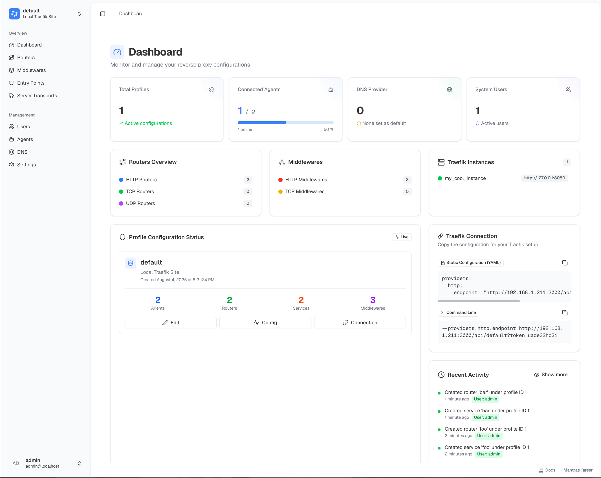

  

# Mantræ

**Mantræ** is a user-friendly web interface designed to simplify the management of Traefik's dynamic configurations. Similar to Nginx Proxy Manager (NPM), this application allows you to manage your dynamic Traefik configuration from the comfort of a simple web ui.

## Features

- **Simplified UI**: A clean and intuitive interface that keeps the complexity to a minimum.
- **Router Configuration**: Create and manage Traefik routers with custom rules, entrypoints, and middleware configurations.
- **Middleware Management**: Add middlewares to your routers, including rate limiting, authentication, and more.
- **Service Status**: Monitor the status of your services and see their health information.
- **DNS Providers**: Support for multiple DNS providers (currently Cloudflare, PowerDNS, Technitium) for automatic DNS record updates.
- **Agents**: Instead of defining your routers in the web ui, you can label your containers as usual using traefik labels. Start the agent on the machine and it will automatically set everything up for you.

## 🚧 Disclaimer 🚧

This project is still early in development and is not ready for production use. Expect a lot of breaking changes in meantime until the first stable release.
Also you can try out nightly builds with the `nightly` tag. But beware, these builds will break your database! 
### Documentation

Check out the [docs](https://mizuchi.dev/mantrae/) for more information.

### Screenshot

## Roadmap

- Add support for more DNS providers
- User management and permissions system
- Stable API

## Contributing

Contributions are welcome! Please feel free to submit issues, fork the repository, and create pull requests.

## License

This project is licensed under the MIT License - see the [LICENSE](LICENSE) file for details.

## Acknowledgements

- [**Traefik**](https://traefik.io/): For providing the powerful reverse proxy that powers this application.
- [**Nginx Proxy Manager**](https://github.com/NginxProxyManager/nginx-proxy-manager): For inspiration on building a simple and effective web UI for managing reverse proxies.
- [**External-DNS**](https://github.com/kubernetes-sigs/external-dns): For inspiration on building a simple DNS management system.
